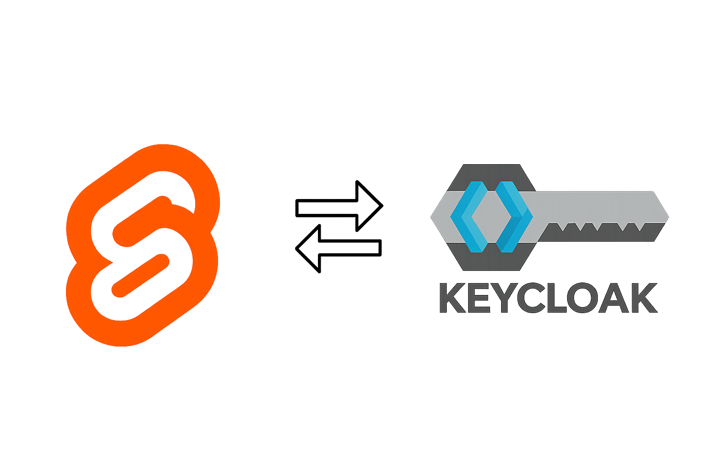

<h1 align="center">
  
  <br/>
  🔒 Custom Onboarding with SvelteKit + Keycloak 🔓
</h1>
<h3 align="center">
  End-to-end authentication and onboarding flow using <b>Keycloak</b> for identity management and <b>SvelteKit</b> for a reactive front end.
</h3>
<p align="center">
  
</p>

## 📝 About

This repository demonstrates how to **replace Keycloak’s built-in login UI with a custom onboarding and authentication flow** implemented in **SvelteKit**, while still using **Keycloak** as the identity provider and token service.

Instead of redirecting users to Keycloak’s hosted login page, this project adds an abstraction layer that lets you present branded, multi-step onboarding and custom sign-in/sign-up forms inside your app. Authentication and token management are handled via the official [`keycloak-js`](https://www.npmjs.com/package/keycloak-js) adapter.

### What you get

- A working example showing how to **collect extra profile fields** and run multi-step onboarding inside SvelteKit.
- Patterns for integrating the **official `keycloak-js` adapter** to obtain and refresh tokens.
- Guidance on where to place server-side logic (optional) for token validation and secure operations.
- An extensible foundation for progressive profiling, social login plumbing, and custom UX.

### How it works (high level)

1. Users interact with your **custom SvelteKit forms** (signup, login, onboarding).
2. The frontend uses the **`keycloak-js` adapter** to talk to Keycloak (token requests, refresh, logout).
3. Tokens are stored/managed according to the chosen pattern (frontend-only or backend-assisted).
4. Optionally, the backend validates tokens and performs server-side calls to Keycloak (user creation, role mapping, etc.).

### Why use this pattern

- **Full control of UX** — brand the entire onboarding experience and present extra fields or steps.
- **Keep Keycloak as the source of truth** for identity, tokens and role management.
- **Flexible** — suitable for SPAs that want a custom flow while still relying on Keycloak’s security features.

> [!CAUTION]
> This repository is educational and demonstrates integration patterns. Replacing Keycloak’s hosted login page places responsibility for secure credential handling, password policies, and anti-abuse protections on your app. Prefer **Authorization Code Flow with PKCE** and/or backend-assisted exchanges for production deployments. Review Keycloak best practices before deploying.

## ⚙️ Installation

Follow these steps to set up the **SvelteKit + Keycloak Custom Onboarding** example locally.

---

### 1. 📦 Clone the Repository

Start by cloning the project from GitHub:

```bash
git clone https://github.com/Bitxo92/keycloak_custom_onboarding.git
cd keycloak_custom_onboarding
```

> [!NOTE]
> Make sure you have **Node.js** installed before running the setup. It’s recommended to use **[NVM (Node Version Manager)](https://github.com/nvm-sh/nvm)** to easily install and manage Node.js versions across different projects.
>
> For example:
>
> ```bash
> nvm install --lts
> nvm use --lts
> ```
>
> This ensures you’re running a compatible Node.js version for SvelteKit and Vite.

### 2. 🐳 Set Up Docker Environment

This project relies on Docker Desktop to spin up a local Keycloak and PostgreSQL environment.

#### Pull the required Bitnami images:

```bash
docker pull bitnami/keycloak:latest
docker pull bitnami/postgresql:latest
```

#### Create a docker network so the conatiners can comunicate

```bash
docker network create keycloak_net
```

#### Run PostgreSQL (Always First!)

```bash
docker run -d \
  --name keycloak_db \
  --network keycloak_net \
  -e POSTGRESQL_USERNAME=bn_keycloak \
  -e POSTGRESQL_PASSWORD=bitnami \
  -e POSTGRESQL_DATABASE=bitnami_keycloak \
  bitnami/postgresql:latest

```

#### Run Keycloak and link to DB

```bash
docker run -d \
  --name keycloak \
  --network keycloak_net \
  -p 8080:8080 \
  -e KEYCLOAK_DATABASE_HOST=keycloak_db \
  -e KEYCLOAK_DATABASE_PORT=5432 \
  -e KEYCLOAK_DATABASE_NAME=bitnami_keycloak \
  -e KEYCLOAK_DATABASE_USER=bn_keycloak \
  -e KEYCLOAK_DATABASE_PASSWORD=bitnami \
  -e KEYCLOAK_ADMIN_USER=admin \
  -e KEYCLOAK_ADMIN_PASSWORD=admin \
  bitnami/keycloak:latest
```

Once both containers are running, open the Keycloak Admin Console at:

👉 [http://localhost:8080](http://localhost:8080)

and log in with:

```text
Username: admin
Password: admin
```
